# Bandeiras do Brasil: Estados + Municípios

## Brazilian State & Municipality Flag Icons

Pacote de ícones com bandeiras dos **27 Estados** + **4.366 Municípios** brasileiros em 4 estilos SVG + 8 variantes PNG, com API TypeScript para busca programática.

Icon pack with flags for all **27 Brazilian states** + **4,366 municipalities** in 4 SVG styles + 8 PNG variants, with a TypeScript API for programmatic lookup.

---

## Capitais / State Capitals

| | | | |
|:---:|:---:|:---:|:---:|
|  | 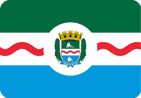 | 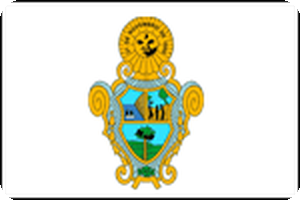 | 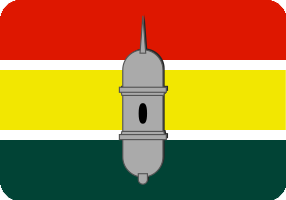 |
| **AC** Rio Branco | **AL** Maceió | **AM** Manaus | **AP** Macapá |
| 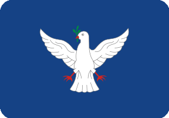 | 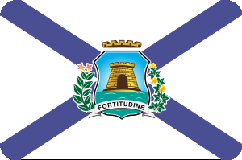 |  | 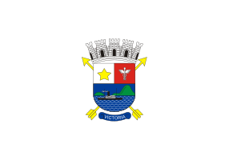 |
| **BA** Salvador | **CE** Fortaleza | **DF** Brasília | **ES** Vitória |
|  | 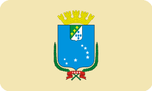 | 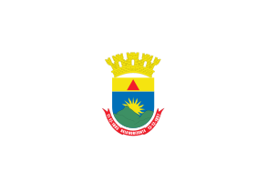 | 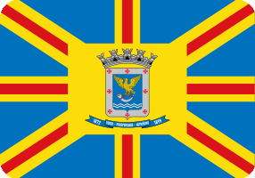 |
| **GO** Goiânia | **MA** São Luís | **MG** Belo Horizonte | **MS** Campo Grande |
| 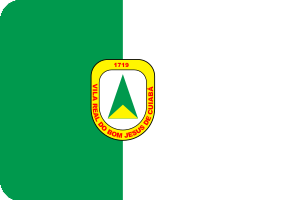 | 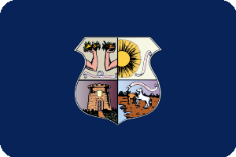 | 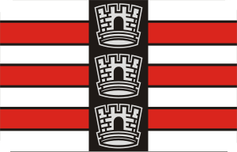 | 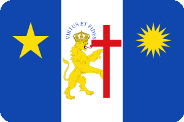 |
| **MT** Cuiabá | **PA** Belém | **PB** João Pessoa | **PE** Recife |
| 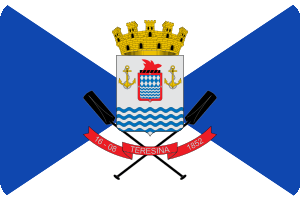 | 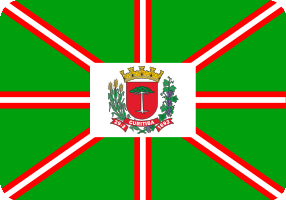 | 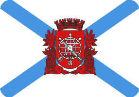 | 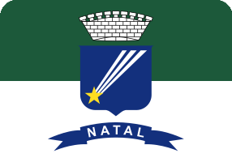 |
| **PI** Teresina | **PR** Curitiba | **RJ** Rio de Janeiro | **RN** Natal |
|  |  | 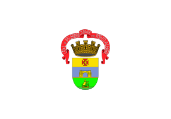 | 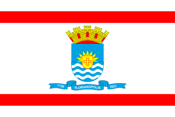 |
| **RO** Porto Velho | **RR** Boa Vista | **RS** Porto Alegre | **SC** Florianópolis |
| 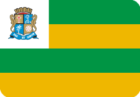 | 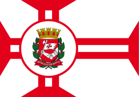 | 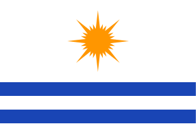 | |
| **SE** Aracaju | **SP** São Paulo | **TO** Palmas | |

---

## Installation

```bash
npm install bandeiras-municipios-br
```

Or clone the repo for direct file access:

```bash
git clone https://github.com/nataliasm23/icones-bandeiras-br-uf.git
```

---

## Quick Start

```typescript
import {
  getMunicipio,
  getFlagPath,
  searchMunicipios,
  getMunicipiosWithFlags,
  stats,
} from "bandeiras-municipios-br";

// Look up by IBGE code
const sp = getMunicipio(3550308);
console.log(sp?.name); // "São Paulo"

// Get icon file path
const path = getFlagPath(3550308, "circle", "svg");
// "circle/svg/SP/3550308-sao-paulo-circle.svg"

// Get full URL with a CDN base
import { getFlagUrl } from "bandeiras-municipios-br";
const url = getFlagUrl(3550308, "circle", "png-200", "https://cdn.example.com/flags");
// "https://cdn.example.com/flags/circle/png-200/SP/3550308-sao-paulo-circle.png"

// Search by name
const results = searchMunicipios("curitiba");
console.log(results[0]?.ibge_code); // 4106902

// List municipalities with flags for a state
const rjFlags = getMunicipiosWithFlags("RJ");
console.log(rjFlags.length); // 92

// Database stats
console.log(stats.total_municipios);   // 5571
console.log(stats.total_with_icons);   // 4366
console.log(stats.icon_coverage_pct);  // 78.4
```

---

## Styles

4 estilos disponíveis / 4 styles available:

| Style | Dimensions | Description |
|-------|-----------|-------------|
| **full** | 300×200 | 3:2 aspect ratio, no clip |
| **rounded** | 300×200 | 3:2 aspect ratio, rounded corners (r=20) |
| **circle** | 200×200 | 1:1, circular clip |
| **square-rounded** | 200×200 | 1:1, rounded square (r=20) |


---

## Coverage by State

| UF | Estado | Total | Flags | Coverage |
|----|--------|------:|------:|---------:|
| AC | Acre | 22 | 14 | 63.6% |
| AL | Alagoas | 102 | 65 | 63.7% |
| AM | Amazonas | 62 | 47 | 75.8% |
| AP | Amapá | 16 | 11 | 68.8% |
| BA | Bahia | 417 | 350 | 83.9% |
| CE | Ceará | 184 | 165 | 89.7% |
| DF | Distrito Federal | 1 | 1 | 100.0% |
| ES | Espírito Santo | 78 | 65 | 83.3% |
| GO | Goiás | 246 | 182 | 74.0% |
| MA | Maranhão | 217 | 135 | 62.2% |
| MG | Minas Gerais | 853 | 602 | 70.6% |
| MS | Mato Grosso do Sul | 79 | 75 | 94.9% |
| MT | Mato Grosso | 142 | 86 | 60.6% |
| PA | Pará | 144 | 105 | 72.9% |
| PB | Paraíba | 223 | 201 | 90.1% |
| PE | Pernambuco | 185 | 135 | 73.0% |
| PI | Piauí | 224 | 93 | 41.5% |
| PR | Paraná | 399 | 275 | 68.9% |
| RJ | Rio de Janeiro | 92 | 92 | 100.0% |
| RN | Rio Grande do Norte | 167 | 127 | 76.0% |
| RO | Rondônia | 52 | 46 | 88.5% |
| RR | Roraima | 15 | 15 | 100.0% |
| RS | Rio Grande do Sul | 497 | 470 | 94.6% |
| SC | Santa Catarina | 295 | 278 | 94.2% |
| SE | Sergipe | 75 | 61 | 81.3% |
| SP | São Paulo | 645 | 631 | 97.8% |
| TO | Tocantins | 139 | 39 | 28.1% |
| | **Total** | **5,571** | **4,366** | **78.4%** |

---

## API Reference

### Types

```typescript
type UF = "AC" | "AL" | "AM" | ... | "TO"      // 27 UF codes
type Region = "N" | "NE" | "CO" | "SE" | "S"    // Macro-regions
type FlagStyle = "full" | "rounded" | "circle" | "square-rounded"
type PngSize = "png-200" | "png-800"
type FlagFormat = "svg" | PngSize

interface Municipio {
  ibge_code: number
  name: string
  slug: string
  uf: UF
  uf_name: string
  region: Region
  region_name: string
  has_flag: boolean
  has_icons: boolean
  flag_source: string | null
  icons?: MunicipioIcons
}

interface MunicipioIcons {
  full_svg: string
  "full_png-200": string
  "full_png-800": string
  rounded_svg: string
  "rounded_png-200": string
  "rounded_png-800": string
  circle_svg: string
  "circle_png-200": string
  "circle_png-800": string
  "square-rounded_svg": string
  "square-rounded_png-200": string
  "square-rounded_png-800": string
}
```

### Functions

| Function | Description |
|----------|-------------|
| `getMunicipio(ibgeCode)` | Look up a municipality by IBGE code |
| `getMunicipiosByUf(uf)` | Get all municipalities for a UF |
| `getMunicipiosWithFlags(uf?)` | Get municipalities with generated icons |
| `searchMunicipios(query)` | Search by name or slug |
| `getFlagPath(ibgeCode, style, format)` | Get relative icon file path |
| `getFlagUrl(ibgeCode, style, format, baseUrl)` | Get full URL with base |
| `getAllFlagPaths(ibgeCode)` | Get all 12 icon paths for a municipality |
| `buildFlagPath(uf, ibgeCode, slug, style, format)` | Build path from components |

### Constants

| Constant | Type | Description |
|----------|------|-------------|
| `UF_NAMES` | `Record<UF, string>` | Full state names |
| `UF_CAPITALS` | `Record<UF, { name, ibgeCode }>` | Capital city per UF |
| `REGIONS` | `Record<Region, UF[]>` | UFs by macro-region |
| `REGION_NAMES` | `Record<Region, string>` | Region full names |
| `ALL_UFS` | `UF[]` | Sorted list of all 27 UF codes |

### Data

| Export | Type | Description |
|--------|------|-------------|
| `municipios` | `Municipio[]` | All 5,571 municipalities |
| `municipiosByUf` | `Record<UF, Municipio[]>` | Grouped by state |
| `stats` | `DatabaseStats` | Coverage statistics |

---

## File Structure

```
dist/
├── full/
│   ├── svg/{UF}/{ibge_code}-{slug}-full.svg          # 300×200
│   ├── png-200/{UF}/{ibge_code}-{slug}-full.png       # 300×200
│   └── png-800/{UF}/{ibge_code}-{slug}-full.png       # 1200×800
├── rounded/
│   ├── svg/{UF}/{ibge_code}-{slug}-rounded.svg        # 300×200, r=20
│   ├── png-200/{UF}/{ibge_code}-{slug}-rounded.png    # 300×200
│   └── png-800/{UF}/{ibge_code}-{slug}-rounded.png    # 1200×800
├── circle/
│   ├── svg/{UF}/{ibge_code}-{slug}-circle.svg         # 200×200
│   ├── png-200/{UF}/{ibge_code}-{slug}-circle.png     # 200×200
│   └── png-800/{UF}/{ibge_code}-{slug}-circle.png     # 800×800
└── square-rounded/
    ├── svg/{UF}/{ibge_code}-{slug}-sq.svg             # 200×200, r=20
    ├── png-200/{UF}/{ibge_code}-{slug}-sq.png         # 200×200
    └── png-800/{UF}/{ibge_code}-{slug}-sq.png         # 800×800

database/
├── municipios.json          # All 5,571 municipalities with icon paths
├── municipios-by-uf.json    # Grouped by state
└── stats.json               # Coverage statistics

src/                         # TypeScript source
├── index.ts                 # Barrel export
├── types.ts                 # Type definitions
├── constants.ts             # UF names, capitals, regions
├── data.ts                  # JSON database loaders
├── municipios.ts            # Lookup functions
└── flags.ts                 # Flag path resolution
```

### Naming Convention

Files follow the pattern: `{ibge_code}-{slug}-{style}.{ext}`

- **ibge_code**: Official IBGE municipality code (7 digits)
- **slug**: URL-friendly municipality name (lowercase, hyphenated)
- **style**: `full`, `rounded`, `circle`, or `sq`

Example: `3550308-sao-paulo-circle.svg` (City of São Paulo, circle style)

---

## Direct File Access

```html
<!-- SVG (recommended for web) -->


<!-- PNG 200px -->
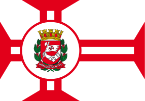

<!-- PNG 800px (high resolution) -->

```

### Database Lookup (Python)

```python
import json

with open("database/municipios.json") as f:
    municipios = json.load(f)

sp = next(m for m in municipios if m["ibge_code"] == 3550308)
if sp["has_icons"]:
    print(f'dist/{sp["icons"]["circle_svg"]}')
```

---

## Generation

### Prerequisites

- Python 3.8+
- Pillow (`pip install Pillow`)
- tqdm (`pip install tqdm`)
- rsvg-convert (`brew install librsvg` on macOS)

### Generate icons

```bash
# All flags, all formats (4 SVG + 8 PNG per flag)
python3 scripts/generate-icons.py

# SVG only (faster)
python3 scripts/generate-icons.py --skip-png

# Single state
python3 scripts/generate-icons.py --uf SP

# More parallelism
python3 scripts/generate-icons.py --workers 8
```

### Build database

```bash
python3 scripts/build-database.py
```

---

## State Flags (Original)

The original 27 state flags from the forked repo are hand-crafted SVGs in Adobe Illustrator:

#### Square-rounded


#### Circle


#### Rounded


#### Full


---

## Data Sources

- **Wikidata** — Structured flag data via SPARQL queries
- **Wikimedia Commons** — Category and search-based discovery
- **Wikipedia** — Municipality page scraping
- **City government websites** — Official municipal sources

All flags are public domain or freely licensed.

---

## Credits

- Original state flag icons by [Pierre Lapalu](https://github.com/pierrelapalu/icones-bandeiras-br-uf)
- Municipality flags scraped from Wikimedia/Wikidata (public domain)
- IBGE municipality codes from [IBGE](https://www.ibge.gov.br/)

---

## License

MIT
