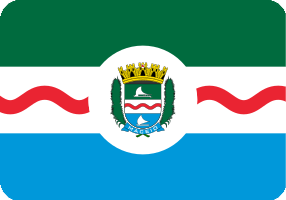
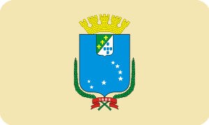
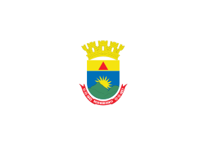
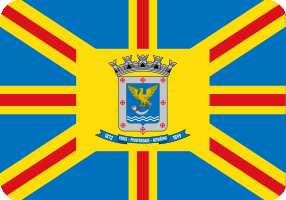
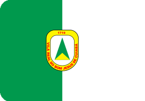
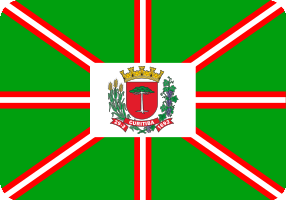
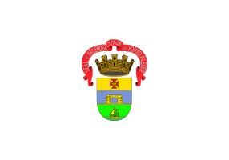
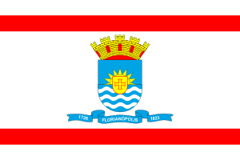
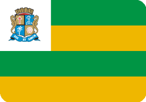

# municipios-br

Banco de dados completo dos **5.571 municípios** brasileiros com bandeiras, CEPs, geolocalização, dados demograficos, socioeconomicos e API TypeScript.

**v2.1** — Dados socioeconomicos do IBGE: PIB, IDH, bioma, gentilico, prefeito, mortalidade infantil, Gini, saude, SIAFI, fuso horario.

---

## Capitais

| | | | |
|:---:|:---:|:---:|:---:|
|  |  |  |  |
| **AC** Rio Branco | **AL** Maceio | **AM** Manaus | **AP** Macapa |
|  |  |  |  |
| **BA** Salvador | **CE** Fortaleza | **DF** Brasilia | **ES** Vitoria |
|  |  |  |  |
| **GO** Goiania | **MA** Sao Luis | **MG** Belo Horizonte | **MS** Campo Grande |
|  |  |  |  |
| **MT** Cuiaba | **PA** Belem | **PB** Joao Pessoa | **PE** Recife |
|  |  |  |  |
| **PI** Teresina | **PR** Curitiba | **RJ** Rio de Janeiro | **RN** Natal |
|  |  |  |  |
| **RO** Porto Velho | **RR** Boa Vista | **RS** Porto Alegre | **SC** Florianopolis |
|  |  |  | |
| **SE** Aracaju | **SP** Sao Paulo | **TO** Palmas | |

---

## O que tem no banco

| Categoria | Dados | Cobertura |
|-----------|-------|-----------|
| **Identificacao** | Codigo IBGE, nome, slug, UF, regiao, capital, SIAFI | 5.571/5.571 (100%) |
| **Hierarquia IBGE** | Microrregiao, mesorregiao, regiao imediata, intermediaria | 5.571/5.571 (100%) |
| **Demografia** | Populacao Censo 2022, estimativa 2025, area km2, densidade | 5.571/5.571 (100%) |
| **Geolocalizacao** | Latitude, longitude, fuso horario | 5.571/5.571 (100%) |
| **Economia** | PIB, PIB per capita | 5.570/5.571 (100%) |
| **Social** | Gentilico, bioma, sistema costeiro, indice Gini | 5.507-5.571 (98.9-100%) |
| **Saude** | Mortalidade infantil, estabelecimentos de saude | 5.562-5.565 (99.8-99.9%) |
| **Governo** | Prefeito atual, codigo SIAFI | 5.569-5.571 (100%) |
| **Telefonia** | DDD | 5.571/5.571 (100%) |
| **Enderecos** | CEP sede + 1.277.567 CEPs com logradouro, bairro | 5.558/5.571 (99.8%) |
| **Bandeiras** | SVG + PNG em 4 estilos | 4.381/5.571 (78.6%) |

---

## Instalacao

```bash
npm install municipios-br
```

---

## Uso Rapido

### Municipios

```typescript
import {
  getMunicipio,
  getMunicipiosByUf,
  getMunicipiosWithFlags,
  searchMunicipios,
  getFlagPath,
  getFlagUrl,
  stats,
} from "municipios-br";

// Buscar por codigo IBGE
const sp = getMunicipio(3550308);
console.log(sp?.name);                  // "Sao Paulo"
console.log(sp?.gentilico);            // "paulistano"
console.log(sp?.bioma);                // "Mata Atlantica"
console.log(sp?.capital);              // true
console.log(sp?.populacao_2022);        // 11451245
console.log(sp?.populacao_estimada_2025); // 11895578
console.log(sp?.area_km2);             // 1521.11
console.log(sp?.pib_per_capita);       // 93156.23
console.log(sp?.indice_gini);          // 0.45
console.log(sp?.prefeito);             // "RICARDO LUIS REIS NUNES"
console.log(sp?.fuso_horario);         // "America/Sao_Paulo"
console.log(sp?.latitude);             // -23.5475
console.log(sp?.longitude);            // -46.6361
console.log(sp?.ddd);                  // "11"
console.log(sp?.cep_sede);             // "01001-000"

// Caminho do icone
const path = getFlagPath(3550308, "circle", "svg");
// "circle/svg/SP/3550308-sao-paulo-circle.svg"

// URL via CDN
const url = getFlagUrl(
  3550308, "circle", "png-200",
  "https://cdn.jsdelivr.net/gh/nataliasm23/icones-bandeiras-br-uf@master/dist"
);

// Busca por nome
const results = searchMunicipios("curitiba");
console.log(results[0]?.ibge_code); // 4106902

// Municipios por estado
const rj = getMunicipiosByUf("RJ");
console.log(rj.length); // 92

// Municipios com bandeiras
const rjFlags = getMunicipiosWithFlags("RJ");
console.log(rjFlags.length); // 92

// Estatisticas
console.log(stats.total_municipios);  // 5571
console.log(stats.total_with_icons);  // 4381
```

### CEPs

```typescript
import {
  getCep,
  searchCeps,
  getCepsByMunicipio,
  getCepsByUf,
  getUfFromCep,
  isValidCepFormat,
  normalizeCep,
} from "municipios-br/ceps";

// Buscar CEP
const cep = getCep("01001-000");
console.log(cep?.logradouro);  // "Praca da Se"
console.log(cep?.bairro);     // "Se"
console.log(cep?.localidade); // "Sao Paulo"
console.log(cep?.uf);         // "SP"
console.log(cep?.ibge);       // "3550308"

// Buscar por logradouro, bairro ou localidade
const results = searchCeps("Paulista", { uf: "SP", limit: 10 });

// CEPs de um municipio (pelo codigo IBGE)
const spCeps = getCepsByMunicipio("3550308");
console.log(spCeps.length); // ~28000

// CEPs de uma UF inteira
const rjCeps = getCepsByUf("RJ");

// Descobrir UF pelo CEP (sem consulta ao banco)
const uf = getUfFromCep("01001-000"); // "SP"

// Validacao e normalizacao
isValidCepFormat("01001-000"); // true
normalizeCep("01001-000");     // "01001000"
```

### Acesso direto ao SQLite (Python)

```python
import sqlite3, json

conn = sqlite3.connect("database/municipios-br.sqlite")
conn.row_factory = sqlite3.Row

# Buscar municipio
row = conn.execute(
    "SELECT * FROM municipios WHERE ibge_code = ?", (3550308,)
).fetchone()
print(row["name"], row["populacao_2022"], row["area_km2"])

# Full-text search de municipios
for r in conn.execute(
    "SELECT ibge_code, name, uf FROM municipios_fts WHERE municipios_fts MATCH ?",
    ("curitiba",)
):
    print(r["ibge_code"], r["name"], r["uf"])

# Buscar CEP
cep = conn.execute("SELECT * FROM ceps WHERE cep = ?", ("01001000",)).fetchone()
print(cep["logradouro"], cep["localidade"])

# Full-text search de CEPs
for r in conn.execute(
    "SELECT cep, logradouro, localidade FROM ceps_fts WHERE ceps_fts MATCH ?",
    ("Paulista",)
).fetchmany(10):
    print(r["cep"], r["logradouro"], r["localidade"])

conn.close()
```

---

## Dados por Municipio

Cada municipio no banco contem:

| Campo | Tipo | Descricao |
|-------|------|-----------|
| `ibge_code` | `number` | Codigo IBGE de 7 digitos |
| `name` | `string` | Nome oficial |
| `slug` | `string` | Nome URL-safe (minusculas, hifenizado) |
| `uf` | `UF` | Sigla do estado (AC..TO) |
| `uf_name` | `string` | Nome completo do estado |
| `region` | `Region` | Macrorregiao (N, NE, CO, SE, S) |
| `region_name` | `string` | Nome da macrorregiao |
| `microrregiao` | `string` | Microrregiao IBGE |
| `mesorregiao` | `string` | Mesorregiao IBGE |
| `regiao_imediata` | `string` | Regiao geografica imediata |
| `regiao_intermediaria` | `string` | Regiao geografica intermediaria |
| `populacao_2022` | `number` | Populacao Censo 2022 |
| `populacao_estimada_2025` | `number` | Estimativa populacional 2025 |
| `area_km2` | `number` | Area territorial (km2) |
| `densidade_demo` | `number` | Densidade demografica (hab/km2) |
| `latitude` | `number` | Latitude da sede |
| `longitude` | `number` | Longitude da sede |
| `ddd` | `string` | Codigo DDD |
| `cep_sede` | `string` | CEP da sede do municipio |
| `gentilico` | `string` | Gentilico ("paulistano", "carioca") |
| `bioma` | `string` | Bioma predominante (Amazonia, Cerrado, Mata Atlantica, etc.) |
| `sistema_costeiro` | `boolean` | Pertence ao sistema costeiro-marinho |
| `prefeito` | `string` | Nome do prefeito atual |
| `pib` | `number` | PIB municipal (R$ x 1.000) |
| `pib_per_capita` | `number` | PIB per capita (R$) |
| `taxa_mortalidade_infantil` | `number` | Mortalidade infantil (por 1.000 nascidos vivos) |
| `indice_gini` | `number` | Indice de Gini (desigualdade de renda) |
| `estabelecimentos_saude` | `number` | Numero de estabelecimentos de saude |
| `codigo_siafi` | `string` | Codigo SIAFI (Tesouro Nacional) |
| `fuso_horario` | `string` | Fuso horario (ex: "America/Sao_Paulo") |
| `capital` | `boolean` | Se e capital estadual |
| `has_flag` | `boolean` | Tem bandeira original |
| `has_icons` | `boolean` | Tem icones gerados |
| `flag_source` | `string` | Fonte da bandeira |
| `icons` | `MunicipioIcons` | Mapa de caminhos dos 12 icones |

---

## Tabela CEPs

1.277.567 registros com busca full-text (FTS5):

| Campo | Tipo | Descricao |
|-------|------|-----------|
| `cep` | `string` | CEP de 8 digitos |
| `logradouro` | `string` | Nome da rua/avenida |
| `complemento` | `string` | Complemento |
| `bairro` | `string` | Bairro |
| `localidade` | `string` | Cidade/localidade |
| `uf` | `string` | UF |
| `ibge` | `string` | Codigo IBGE do municipio |
| `ddd` | `string` | DDD |
| `source` | `string` | Fonte (json-import, opencep) |

---

## Estilos de Bandeira

4 estilos, cada um em SVG + PNG (200px e 800px):

| Estilo | Dimensoes | Descricao |
|--------|-----------|-----------|
| **full** | 300x200 | Proporcao 3:2, sem recorte |
| **rounded** | 300x200 | Proporcao 3:2, cantos arredondados (r=20) |
| **circle** | 200x200 | 1:1, recorte circular |
| **square-rounded** | 200x200 | 1:1, quadrado arredondado (r=20) |


---

## Cobertura de Bandeiras por Estado

| UF | Estado | Total | Bandeiras | Cobertura |
|----|--------|------:|------:|---------:|
| AC | Acre | 22 | 14 | 63.6% |
| AL | Alagoas | 102 | 65 | 63.7% |
| AM | Amazonas | 62 | 47 | 75.8% |
| AP | Amapa | 16 | 11 | 68.8% |
| BA | Bahia | 417 | 350 | 83.9% |
| CE | Ceara | 184 | 165 | 89.7% |
| DF | Distrito Federal | 1 | 1 | 100.0% |
| ES | Espirito Santo | 78 | 65 | 83.3% |
| GO | Goias | 246 | 182 | 74.0% |
| MA | Maranhao | 217 | 135 | 62.2% |
| MG | Minas Gerais | 853 | 602 | 70.6% |
| MS | Mato Grosso do Sul | 79 | 75 | 94.9% |
| MT | Mato Grosso | 142 | 86 | 60.6% |
| PA | Para | 144 | 105 | 72.9% |
| PB | Paraiba | 223 | 201 | 90.1% |
| PE | Pernambuco | 185 | 135 | 73.0% |
| PI | Piaui | 224 | 93 | 41.5% |
| PR | Parana | 399 | 275 | 68.9% |
| RJ | Rio de Janeiro | 92 | 92 | 100.0% |
| RN | Rio Grande do Norte | 167 | 127 | 76.0% |
| RO | Rondonia | 52 | 46 | 88.5% |
| RR | Roraima | 15 | 15 | 100.0% |
| RS | Rio Grande do Sul | 497 | 470 | 94.6% |
| SC | Santa Catarina | 295 | 278 | 94.2% |
| SE | Sergipe | 75 | 61 | 81.3% |
| SP | Sao Paulo | 645 | 631 | 97.8% |
| TO | Tocantins | 139 | 39 | 28.1% |
| | **Total** | **5.571** | **4.381** | **78.6%** |

---

## Referencia da API

### Tipos

```typescript
type UF = "AC" | "AL" | "AM" | ... | "TO"      // 27 codigos UF
type Region = "N" | "NE" | "CO" | "SE" | "S"    // Macrorregioes
type FlagStyle = "full" | "rounded" | "circle" | "square-rounded"
type PngSize = "png-200" | "png-800"
type FlagFormat = "svg" | PngSize

interface Municipio {
  ibge_code: number
  name: string
  slug: string
  uf: UF
  uf_name: string
  region: Region
  region_name: string
  has_flag: boolean
  has_icons: boolean
  flag_source: string | null
  microrregiao?: string
  mesorregiao?: string
  regiao_imediata?: string
  regiao_intermediaria?: string
  populacao_2022?: number
  populacao_estimada_2025?: number
  area_km2?: number
  densidade_demo?: number
  latitude?: number
  longitude?: number
  ddd?: string
  cep_sede?: string
  gentilico?: string
  bioma?: string
  sistema_costeiro?: boolean
  prefeito?: string
  pib?: number
  pib_per_capita?: number
  taxa_mortalidade_infantil?: number
  indice_gini?: number
  estabelecimentos_saude?: number
  codigo_siafi?: string
  fuso_horario?: string
  capital?: boolean
  icons?: MunicipioIcons
}

interface CepRecord {
  cep: string
  logradouro: string
  complemento: string
  bairro: string
  localidade: string
  uf: UF
  ibge: string
  ddd: string
}
```

### Funcoes de Municipios

| Funcao | Descricao |
|--------|-----------|
| `getMunicipio(ibgeCode)` | Busca municipio pelo codigo IBGE |
| `getMunicipiosByUf(uf)` | Todos os municipios de uma UF |
| `getMunicipiosWithFlags(uf?)` | Municipios com icones gerados |
| `searchMunicipios(query)` | Busca por nome ou slug |
| `getFlagPath(ibgeCode, style, format)` | Caminho relativo do icone |
| `getFlagUrl(ibgeCode, style, format, baseUrl)` | URL completa com base |
| `getAllFlagPaths(ibgeCode)` | Os 12 caminhos de icone do municipio |
| `buildFlagPath(uf, ibgeCode, slug, style, format)` | Monta caminho a partir dos componentes |

### Funcoes de CEPs (`municipios-br/ceps`)

| Funcao | Descricao |
|--------|-----------|
| `getCep(cep)` | Busca CEP por numero |
| `searchCeps(query, options?)` | Busca por logradouro, bairro ou localidade |
| `getCepsByMunicipio(ibgeCode)` | Todos os CEPs de um municipio |
| `getCepsByUf(uf)` | Todos os CEPs de uma UF |
| `getUfFromCep(cep)` | Descobre a UF pelo prefixo do CEP |
| `isValidCepFormat(cep)` | Valida formato do CEP |
| `normalizeCep(cep)` | Remove formatacao (pontos, tracos) |
| `syncCeps(options?)` | Sincroniza CEPs com ViaCEP |
| `getCepsSyncDate()` | Data da ultima sincronizacao |

### Constantes

| Constante | Tipo | Descricao |
|-----------|------|-----------|
| `UF_NAMES` | `Record<UF, string>` | Nomes completos dos estados |
| `UF_CAPITALS` | `Record<UF, { name, ibgeCode }>` | Capital de cada UF |
| `REGIONS` | `Record<Region, UF[]>` | UFs por macrorregiao |
| `REGION_NAMES` | `Record<Region, string>` | Nomes das macrorregioes |
| `ALL_UFS` | `UF[]` | Lista ordenada dos 27 codigos UF |
| `CEP_UF_PREFIXES` | `Record<UF, [number, number][]>` | Faixas de CEP por UF |
| `IBGE_UF_MAP` | `Record<string, UF>` | Mapa prefixo IBGE para UF |

### Dados

| Export | Tipo | Descricao |
|--------|------|-----------|
| `municipios` | `Municipio[]` | Todos os 5.571 municipios |
| `municipiosByUf` | `Record<UF, Municipio[]>` | Agrupados por estado |
| `stats` | `DatabaseStats` | Estatisticas de cobertura |
| `closeDb()` | `void` | Fecha a conexao SQLite |

---

## Estrutura de Arquivos

```
dist/
  full/svg|png-200|png-800/{UF}/{ibge}-{slug}-full.svg|png
  rounded/svg|png-200|png-800/{UF}/{ibge}-{slug}-rounded.svg|png
  circle/svg|png-200|png-800/{UF}/{ibge}-{slug}-circle.svg|png
  square-rounded/svg|png-200|png-800/{UF}/{ibge}-{slug}-sq.svg|png

database/
  municipios-br.sqlite     # 5.571 municipios + 1.28M CEPs + FTS5

src/
  index.ts                 # Barrel export
  types.ts                 # Definicoes de tipos
  constants.ts             # UFs, capitais, regioes, prefixos CEP
  db.ts                    # Singleton SQLite (better-sqlite3)
  data.ts                  # Carregamento do banco
  municipios.ts            # Funcoes de busca de municipios
  flags.ts                 # Resolucao de caminhos de bandeiras
  ceps/
    index.ts               # Barrel export
    types.ts               # Tipos de CEP
    ceps.ts                # Busca de CEPs
    data.ts                # Cache de acesso ao banco
    sqlite.ts              # Classe CepDatabase (standalone)
    sync.ts                # Sincronizacao com ViaCEP
```

---

## Roadmap: Dados Faltantes

Dados que complementariam o banco. Todos disponiveis via APIs publicas.

| Campo | Descricao | Fonte |
|-------|-----------|-------|
| `idhm` | IDH Municipal (composto) | Atlas Brasil (download bulk) |
| `idhm_educacao` | IDH-M componente educacao | Atlas Brasil |
| `idhm_longevidade` | IDH-M componente longevidade | Atlas Brasil |
| `idhm_renda` | IDH-M componente renda | Atlas Brasil |
| `populacao_urbana` | Populacao urbana | Censo 2022 / SIDRA |
| `populacao_rural` | Populacao rural | Censo 2022 / SIDRA |
| `amazonia_legal` | Se pertence a Amazonia Legal | Lista oficial IBGE |
| `codigo_tse` | Codigo eleitoral TSE | betafcc/Municipios-Brasileiros-TSE |
| `receita_orcamentaria` | Receita municipal | SICONFI / Tesouro Nacional |
| `clima` | Classificacao climatica Koppen | Dados academicos |
| `altitude_sede` | Altitude da sede (metros) | IBGE geodesia |

---

## Geracao

### Pre-requisitos

- Python 3.8+
- Pillow, tqdm (`pip install Pillow tqdm`)
- rsvg-convert (`brew install librsvg` no macOS)

### Gerar icones

```bash
# CLI unificado
python3 scripts/municipios/cli.py generate-icons
python3 scripts/municipios/cli.py generate-icons --uf SP --skip-png --workers 8

# Pipeline completo (fetch + download + validate + enrich + generate)
python3 scripts/municipios/cli.py pipeline --dry-run
python3 scripts/municipios/cli.py pipeline
```

### Construir banco SQLite

```bash
python3 scripts/build-unified-sqlite.py
```

### Pipeline de CEPs

```bash
python3 scripts/ceps/cli.py scrape --uf SP
python3 scripts/ceps/cli.py validate
python3 scripts/ceps/cli.py export-json
python3 scripts/ceps/cli.py stats
```

---

## Fontes de Dados

| Fonte | Dados |
|-------|-------|
| **IBGE Localidades** | Codigos, nomes, hierarquia territorial |
| **IBGE Censo 2022** | Populacao, area, densidade demografica |
| **IBGE Pesquisas** | Gentilico, bioma, prefeito, PIB, mortalidade infantil, Gini, saude |
| **IBGE Estimativas** | Populacao estimada 2025 |
| **kelvins/municipios-brasileiros** | Codigo SIAFI, fuso horario |
| **ViaCEP** | Enderecos postais (CEPs, logradouros, bairros) |
| **OpenCEP** | Enderecos postais complementares (1.2M registros) |
| **Wikidata** | Dados estruturados de bandeiras via SPARQL |
| **Wikimedia Commons** | Imagens de bandeiras (dominio publico) |
| **Wikipedia** | Scraping de paginas de municipios |
| **Prefeituras** | Fontes municipais oficiais |

---

## Creditos

- Icones estaduais por [Pierre Lapalu](https://github.com/pierrelapalu/icones-bandeiras-br-uf)
- Bandeiras municipais do Wikimedia/Wikidata (dominio publico)
- Dados municipais do [IBGE](https://www.ibge.gov.br/)
- CEPs do [ViaCEP](https://viacep.com.br/) e [OpenCEP](https://github.com/SeuAliado/OpenCEP)

---

## Licenca

MIT
